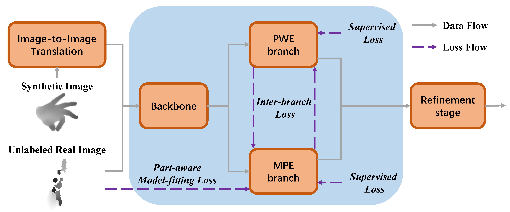
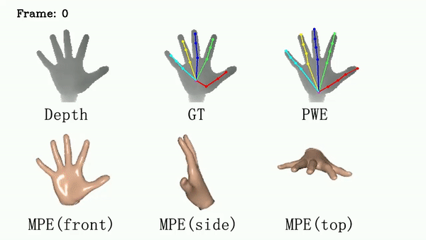

# A Dual-Branch Self-Boosting Framework for Self-Supervised 3D Hand Pose Estimation (TIP2022) 

This is the official PyTorch implementation code. For technical details, please refer to:

**A Dual-Branch Self-Boosting Framework for Self-Supervised 3D Hand Pose Estimation** <br />
Pengfei Ren, Haifeng Sun, Jiachang Hao, Qi Qi, Jingyu Wang, Jianxin Liao <br />
[[Paper]](https://ieeexplore.ieee.org/document/9841448)



## 

↓↑
 |  Method   |   Modality   | SHREC 14| SHREC 28 | DHG 14 | DHG 28 |
 | ---       | :---:        | :---: | :---: |:---: | :---: |
 | PointLSTM | Point clouds | 95.9  | 94.7  | -    | -     |
 | Res-TCN   | Skeleton     | 91.1  | 87.3  | 86.9 | 83.6 |

## Comparison with annotations from ICVL and MSRA datasets
Compared with semi-automatic annotation methods, our self-supervised method can generate more accurate and robust 3D hand pose and hand mesh.




## Installation
### Prerequisites

- Python >= 3.8
- PyTorch >= 1.10
- pytorch3d == 0.4.0
- CUDA (tested with cuda11.3)
- Other dependencies described in requirements.txt

### MANO

- Go to [MANO website](http://mano.is.tue.mpg.de/)
- Download Models and copy the `models/MANO_RIGHT.pkl` into the `MANO` folder
- Your folder structure should look like this:
```
DSF/
  MANO/
    MANO_RIGHT.pkl
```
### NYU Dataset
- Download and decompress [NYU](https://jonathantompson.github.io/NYU_Hand_Pose_Dataset.htm) and modify the `root_dir` in `config.py` according to your setting.
- Download the center files [[Google Drive](https://drive.google.com/drive/folders/1POQ5g3LnzAtXCvtzVF_WJoZuxLoseKuX?usp=sharing)] and put them into the `train` and `test` directories of NYU respectively.
- Your folder structure should look like this:
```
.../
  nyu/
    train/
      center_train_0_refined.txt
      center_train_1_refined.txt
      center_train_2_refined.txt
      ...
    test/
      center_test_0_refined.txt
      center_test_1_refined.txt
      center_test_2_refined.txt
      ...
```
### Pretrained Model
- Download our pre-trained model with self-supervised training [[Google Drive](https://drive.google.com/drive/folders/1XCU3ZifvaF47Fih9y-i47kTshwvcNzii?usp=sharing)]
- Download our pre-trained model with only synthetic data [[Google Drive](https://drive.google.com/drive/folders/1VQDbboU8dVSMi2ZA26mkkDJ3jOPxDTWy?usp=sharing)]
- Download the Consis-CycleGAN model [[Google Drive](https://drive.google.com/drive/folders/1tyiLc8isxyfg7vi8cS9F4gmCzrSmceBc?usp=sharing)]

## Running DSF
### Evaluation
Set `load_model` as the path to the pretrained model and change the `phase` to "test" in config.py, run
```bash
python train_render.py
```

### Self-supervised Training
To perform self-supervised training, set `finetune_dir` as the path to the pretrained model with only synthetic data and `tansferNet_pth` as the path to the Consis-CycleGAN model in config.py.
Then, change the `phase` to "train", run
```bash
python train_render.py
```

### Pre-training with Synthetic Data
To perform pre-training, set `train_stage` to "pretrain" in config.py, run
```bash
python train_render.py
```
### Citation

If you find our work useful in your research, please citing:

```
@ARTICLE{9841448,
  author={Ren, Pengfei and Sun, Haifeng and Hao, Jiachang and Qi, Qi and Wang, Jingyu and Liao, Jianxin},
  journal={IEEE Transactions on Image Processing}, 
  title={A Dual-Branch Self-Boosting Framework for Self-Supervised 3D Hand Pose Estimation}, 
  year={2022},
  volume={31},
  number={},
  pages={5052-5066},
  doi={10.1109/TIP.2022.3192708}}
```

